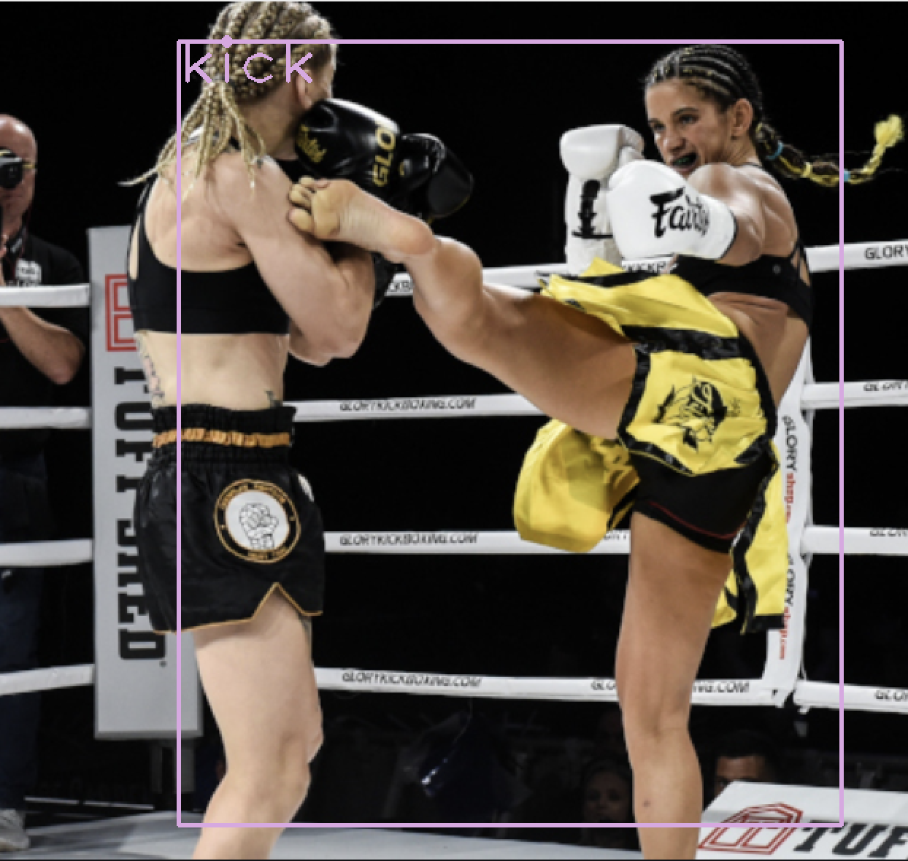

# Classify Muay Thai - Using Computer Vision

### Objective
My goal for this project was to create a model that could watch fights and classify every move.

### Background
What is Muay Thai? Muay thai is a martial art that uses stand-up striking along with various clinching techniques. It’s often called the art of 8 limbs, as it’s characterized by the combined use of fists, elbows, knees, and shins.

I began training Muay Thai in October 2019, and like many people, when the pandemic started I wasn’t able to go in to [Juniper](https://www.junipermuaythai.com/), the Muay Thai gym I was training at. 

For those that wanted to continue training, practicing alone at home meant repeating the same learned combinations over and over again. It also meant no available feedback on how practical or effective a new combo actually is. Hence my goal of classifying Muay Thai fights.

### Methodology

As a proof of concept for my first iteration, I only wanted to train the model on kicks. I downloaded around 200 pictures of kicks and labeled them using [LabelImg](https://github.com/tzutalin/labelImg).
I then leveraged Google Colab's GPU, and YOLOv3 with darknet framework to train a neural network on the images.

[First Iteration (kicks only) - model training notebook](https://github.com/Neda-Sal/Muay_Thai_Strikes/blob/main/training_kicks.ipynb)

The results were quite positive!

The next iteration I added in punches, elbows, and knees along with kicks. The final version of the model was trained on 1,156 pictures consisting of kicking, punching, elbowing, kneeing, clinching, and being in the muay thai stance.

The [training](https://github.com/Neda-Sal/Muay_Thai_Strikes/blob/main/V2_Multi_class_model_training.ipynb) and [testing](https://github.com/Neda-Sal/Muay_Thai_Strikes/blob/main/V2_Multiclass_model_testing.ipynb) notebooks were all originally run in google colab.

### Results

The model is currently able to classify images, pre-recorded videos, and live feed from a webcam.

I built two streamlit apps, one that classifies [images](https://github.com/Neda-Sal/Muay_Thai_Strikes/blob/main/Streamlit_app/classify_pics_app2.py) and another that classifies [video](https://github.com/Neda-Sal/Muay_Thai_Strikes/blob/main/Streamlit_app/classify_video_app2.py) from an mp4 file. 

I tested the model with a threshold of 0.5 on video and those results can be seen [here](https://github.com/Neda-Sal/Muay_Thai_Strikes/blob/main/Multiclass_v2/tiff_v2_thresh_0_5.mp4)

### Next Steps

Next, I would like to incorporate whether or not a combo lands, or if it misses. I would also like to incorporate object tracking to keep track of the different fighters.

My ultimate end goal is to train another model on that data that can recommend best responses and counter attacks based on specific moves, or specific fighting styles.

### Presentation

Presentation Placeholder

